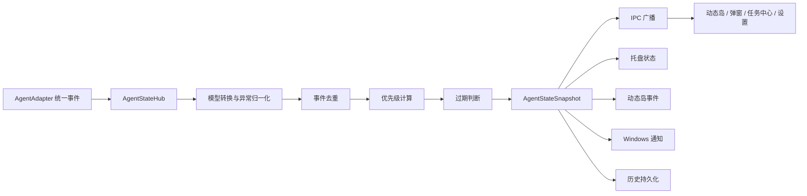
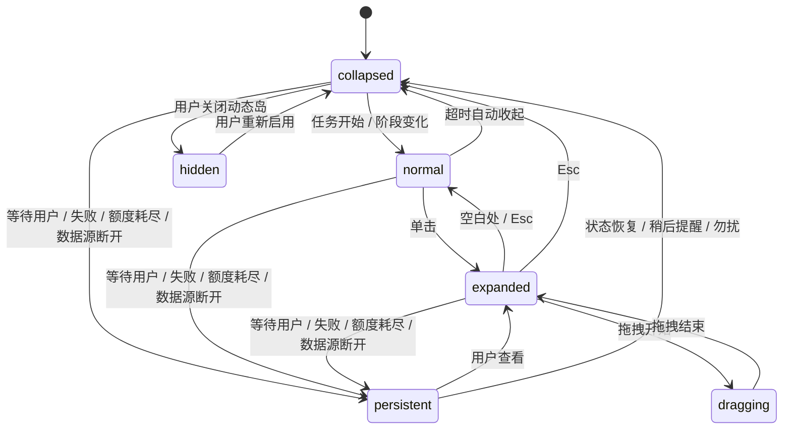

# CodePulse 产品信息架构

## 1. 完整产品信息架构

CodePulse 是 Windows 本地 AI Agent 状态助手。首期围绕“低干扰、强提醒、统一状态”组织信息结构，所有界面只消费 AgentStateHub 输出的统一快照。

### 1.1 全局信息层级

1. 全局状态
   - 当前总体状态：空闲、运行中、等待处理、失败、额度不足、数据源断开。
   - 运行任务数量。
   - 待处理事项数量。
   - 数据源连接状态。
   - 勿扰模式与监控开关。
2. 当前重点任务
   - 任务名称、Agent、项目名称、阶段、运行时长、最近活动。
   - 等待用户内容或错误摘要。
   - 可靠进度、阶段进度或无进度说明。
3. 多任务概览
   - 运行中任务。
   - 等待处理任务。
   - 失败任务。
   - 最近完成任务。
4. 额度与配额
   - 剩余额度百分比。
   - 更新时间、重置时间。
   - 是否估算、是否暂不可用。
5. 历史与诊断
   - 当前快照活动时间线。
   - SQLite 持久化历史任务与历史活动时间线。
   - 历史库损坏恢复、清理状态和运行时诊断。
   - 脱敏诊断导出。
   - 数据源异常与恢复建议。

### 1.2 界面承载关系

1. 动态岛
   - 承载当前最高优先级任务。
   - 用于任务开始、阶段变化、等待用户、失败、完成、额度阈值跨越等短时或持续事件。
   - 不直接读取日志或进程，只订阅状态快照。
2. 系统托盘
   - 承载全局状态入口。
   - 用图标形态和菜单暴露状态面板、任务中心、动态岛开关、勿扰、暂停监控、刷新、设置和退出。
   - 主进程监控 explorer.exe 进程 ID 变化，检测到 Explorer 重启后重建托盘图标；重建失败时记录“托盘图标重建失败”错误状态。
3. 任务栏贴边弹窗
   - 承载持续可扫视状态。
   - 展示任务卡片、额度列表、待处理事项和任务中心入口。
4. 主任务中心
   - 承载完整任务列表、详情、筛选、搜索、刷新、额度统计和历史。
5. 设置页
   - 承载动态岛模式、动态岛位置、固定/跟随显示器、目标显示器、自由坐标、鼠标穿透、全屏隐藏、通知总开关、勿扰模式、勿扰时间、通知阈值、数据源、适配器启用状态、读取和保存失败态。

## 2. 项目目录结构

```text
CodePulse/
  AGENTS.md
  package.json
  pnpm-lock.yaml
  electron-builder.yml
  vite.config.ts
  tsconfig.json
  tsconfig.app.json
  tsconfig.node.json
  tsconfig.vitest.json
  index.html
  src/
    shared/
      types/
      ipc/
      constants/
    main/
      bootstrap/
      windows/
      tray/
      state/
      adapters/
      persistence/
      notifications/
      system/
      ipc/
    preload/
      index.ts
      codePulseApi.ts
    renderer/
      apps/
        island/
        popup/
        center/
        settings/
      components/
      stores/
      router/
      styles/
  docs/
    product-architecture.md
    development.md
    packaging.md
    adapter-extension.md
    troubleshooting.md
    plans/
      2026-07-01-mvp-foundation.md
```

## 3. Electron 窗口规划

### 3.1 动态岛窗口

- 类型：无边框、透明、始终置顶、默认不进任务栏。
- 尺寸：收起态 160 × 36 DIP，标准态 360 × 88 DIP，展开态 420 × 260 DIP。
- 模式：hidden、collapsed、normal、expanded、persistent、dragging。
- 位置：顶部居中、顶部左侧、顶部右侧、屏幕右侧、自由拖拽、固定主显示器、跟随活动显示器。
- 行为：收起态可启用鼠标穿透，展开态和持续态必须关闭鼠标穿透。主进程监听显示器增加、移除和指标变化，变化后重新限制动态岛位置并关闭贴边弹窗。系统休眠前关闭贴边弹窗，恢复后重算动态岛位置并刷新 AgentStateHub。开启全屏自动隐藏后，主进程定时检测前台全屏窗口，检测到全屏应用时隐藏动态岛和贴边弹窗，退出全屏或检测失败时恢复动态岛。

### 3.2 任务栏贴边弹窗

- 类型：无边框，不进入 Alt + Tab，不创建普通任务栏按钮。
- 尺寸：360 × 480 DIP。
- 触发：点击托盘图标开关。
- 关闭：再次点击托盘图标、点击外部、按 Esc。
- 定位：优先托盘图标所在显示器，其次鼠标所在显示器，最后主显示器。

### 3.3 主任务中心窗口

- 类型：普通窗口。
- 行为：关闭后隐藏到托盘。
- 内容：任务列表、任务详情、关键词搜索、状态筛选、数据源筛选、项目筛选、时间筛选、刷新、设置入口、活动时间线、错误详情、数据源异常状态和恢复建议、复制摘要、打开 Agent、打开项目目录、额度和运行统计。
- 当前任务列表默认消费 AgentStateHub 快照；历史任务模式通过受控 `tasks.listHistory(limit?)` 和 `tasks.getHistoryActivities(taskId, limit?)` 查询 SQLite 历史，不向渲染进程暴露文件系统、Shell 或 Node 能力。Codex 任务可通过主进程受控 `tasks.openAgent(taskId)` 在项目目录启动 Codex；非 Codex 任务无法恢复具体会话时会通过同一 IPC 回退打开任务项目目录。

### 3.4 设置窗口

- 类型：普通工具窗口。
- 内容：显示、通知、数据源、适配器、安全与诊断。

## 4. AgentStateHub 数据流



AgentStateHub 负责唯一业务状态。适配器只能输出统一事件，不能直接操作窗口、托盘、通知、数据库或 IPC。

当前历史持久化由主进程订阅 AgentStateHub 快照完成，任务和活动会 upsert 到本地 SQLite 文件。任务中心只通过 Preload 白名单 IPC 查询历史任务和历史活动，适配器、动态岛、贴边弹窗和任务中心仍不直接写数据库。历史库加载时会执行完整性检查；发现数据库损坏时，会将原文件备份为 `.corrupt-时间戳` 文件并重建空库，避免应用启动崩溃。每次加载或保存后会按默认 90 天保留期、任务数量上限和活动数量上限清理历史记录。

## 5. IPC 接口清单

所有主进程 IPC channel 使用 `codepulse:*` 前缀。Preload 只暴露冻结后的 `window.codePulse` 白名单 API。带参数的主进程 IPC 必须先经过参数校验，校验失败统一返回 `IPC_VALIDATION_ERROR`。

任务操作类 IPC 必须在主进程内确认任务存在。当前 `tasks.open`、`tasks.openAgent` 和 `tasks.copySummary` 允许基于 AgentStateHub 当前快照或 SQLite 历史库确认任务；`tasks.openAgent` 对 Codex 任务通过受控 PowerShell 命令在项目目录启动 Codex，对 Process、Log、CustomCommand 和 Mock 等无法恢复具体会话的数据源回退打开任务项目目录；`tasks.snooze` 和 `tasks.markViewed` 仍只允许当前快照中的任务。未知任务不得进入打开、复制、稍后提醒或已读流程。

### 5.1 状态接口

- `state.getSnapshot()`
- `state.subscribe(listener)`
- `state.refresh(providerId?)`

### 5.2 任务接口

- `tasks.open(taskId)`
- `tasks.openAgent(taskId)`
- `tasks.copySummary(taskId)`
- `tasks.listHistory(limit?)`
- `tasks.getHistoryActivities(taskId, limit?)`
- `tasks.snooze(taskId, until)`
- `tasks.markViewed(taskId)`

### 5.3 适配器接口

- `providers.list()`
- `providers.detect()`：返回各适配器检测结果，并同步更新 AgentStateHub 中的提供方连接状态。
- `providers.setEnabled(providerId, enabled)`：仅允许 `codex`、`process`、`log`、`custom-command` 和 `mock-codex`，会同步 AgentStateHub 运行态并持久化设置。

### 5.4 设置接口

- `settings.get()`
- `settings.update(partialSettings)`：通过白名单更新设置；当 provider 启用字段变化时，同步 AgentStateHub 运行态；当 Codex 状态源、Codex 日志源、通用日志源或自定义命令配置变化时，同步运行期适配器配置。

### 5.5 窗口接口

- `windows.openTaskCenter(taskId?)`
- `windows.openSettings()`
- `windows.setIslandMode(mode)`
- `windows.closePopup()`

### 5.6 系统接口

- `system.getDisplays()`
- `system.getConnectionStatus()`

### 5.7 诊断接口

- `diagnostics.exportRedacted()`

诊断导出必须经过脱敏处理，至少移除 Windows 用户目录、项目完整路径、API Key、Token、Authorization、环境变量中的敏感值和命令行敏感参数。当前诊断内容包含 AgentStateHub 快照、通知运行时统计和历史库运行时统计；通知统计只包含去重记录数、稍后提醒记录数和最近清理时间，历史库统计只包含加载状态、损坏恢复状态、备份路径、清理计数和保留策略。

## 6. 动态岛状态机



等待用户、失败、额度耗尽和数据源断开进入 `persistent` 后不得自动消失。普通阶段变化必须节流和去重。

当前动态岛状态机已抽为可测试逻辑，覆盖：

1. 任务开始、阶段变化、任务完成和额度阈值跨越触发短暂展开。
2. 等待用户、任务失败、额度耗尽和数据源断开进入持续提醒。
3. 普通阶段变化节流，避免频繁打扰。
4. 自动收起、悬停暂停自动收起、Esc 收起。
5. 鼠标滚轮在任务之间切换当前展示任务。
6. 稍后提醒会调用受控 IPC，并收起动态岛。
7. 顶部拖拽区域可移动动态岛，主进程会将拖拽后的自由坐标保存到设置中。
8. 自由坐标会限制在显示器工作区内，保存的显示器断开后回落到主显示器。
9. 右键菜单由主进程提供，可执行打开当前任务、打开当前任务对应 Agent、复制当前任务摘要、稍后提醒当前任务、多任务任务列表定位、展开、收起、隐藏、打开任务中心和打开设置。

更多任务级菜单动作策略和 Windows 手测仍属于后续补强范围。

## 7. 任务栏贴边弹窗定位算法

输入：

1. 托盘图标边界。
2. 当前鼠标点。
3. 所有显示器的 `bounds` 与 `workArea`。
4. 弹窗尺寸。
5. 边距与间距。

流程：

1. 尝试选择托盘图标中心所在显示器。
2. 若失败，选择鼠标点所在显示器。
3. 若仍失败，选择主显示器。
4. 比较 `bounds` 与 `workArea` 判断任务栏方向。
5. 若存在自动隐藏任务栏导致差异不明显，则根据托盘图标靠近的屏幕边推断方向。
6. 方向仍不明确时按底部任务栏处理。
7. 计算候选位置：
   - 底部：向上展开。
   - 顶部：向下展开。
   - 左侧：向右展开。
   - 右侧：向左展开。
8. 使用 `clamp` 将最终位置限制在目标显示器有效工作区内。

## 8. MVP 开发阶段

1. 边界确认
   - 产物：`AGENTS.md`。
   - 验证：文件存在、内容完整、UTF-8 without BOM。
2. 工程脚手架
   - 产物：Electron、Vue 3、TypeScript strict、Vite、Pinia、Vue Router、Element Plus、ECharts、SQLite、Electron Builder 基础结构。
   - 验证：`pnpm install`、`pnpm run typecheck`。
3. 共享模型
   - 产物：统一类型、事件模型、适配器接口、IPC schema 和设置模型。
   - 验证：类型检查通过。
4. 状态核心
   - 产物：`MockAdapter`、`AgentStateHub`、优先级、去重、过期、额度不可用和广播。
   - 验证：`pnpm run test` 覆盖状态优先级、事件去重、过期判断、额度不可用不显示 0%、适配器异常隔离。
5. 桌面外壳
   - 产物：单实例锁、托盘动态图标、Explorer 重启后托盘重建、动态岛窗口、贴边弹窗、窗口位置、多显示器热插拔回位和 DPI 指标变化适配。
   - 验证：`pnpm run build`，开发模式可打开动态岛和贴边弹窗；托盘单元测试覆盖 Explorer 重启后重建和重建失败错误状态，窗口单元测试覆盖显示器断开后回到主显示器工作区和显示器指标变化后关闭贴边弹窗。
6. 真实接入
   - 产物：首期 `CodexAdapter` 进程检测、可配置状态源解析、可配置日志源解析、状态源和日志源多字段会话识别、设置页状态源/日志源路径入口和路径运行期热更新最小版本已完成；`ProcessAdapter` 本机 Agent 进程检测最小版本已完成；`LogAdapter` 通用 UTF-8 JSONL 日志源解析、设置页通用日志路径入口和路径运行期热更新最小版本已完成；`CustomCommandAdapter` 默认禁用、显式授权、安全执行和运行期配置同步最小版本已完成；数据源启用与设置持久化联动、设置页启用开关和 Hub 运行态同步最小版本已完成；后续补齐更多 Codex 原生日志格式覆盖。
   - 验证：进程检测异常降级为明确错误状态，状态源和日志源格式错误降级为明确错误状态，额度不可用不显示为 0%，状态源和日志源额度可正常读取；CodexAdapter 测试覆盖运行期更新和清空状态源/日志源路径、状态源 snake_case 会话字段生成稳定任务、日志源 conversation_id 会话合并；ProcessAdapter 测试覆盖已知 Agent 进程识别、运行任务生成、敏感命令行隔离、未运行状态、检测异常降级和额度暂不可用；LogAdapter 测试覆盖 JSONL 最新任务覆盖、额度事件读取、未配置状态、运行期更新和清空日志源路径、解析异常降级、敏感命令行字段隔离和额度暂不可用；CustomCommandAdapter 测试覆盖默认禁用不执行、未授权不执行、授权命令解析任务和额度、运行期更新授权与命令配置、敏感输出脱敏、执行超时降级、输出解析失败降级和额度暂不可用；AgentStateHub 和 IPC 测试覆盖禁用数据源停止适配器、清空该数据源任务和额度、重新启用恢复快照、禁用后跳过刷新和检测、运行期配置同步、`providers.setEnabled` 持久化设置、`settings.update` 启用状态同步 Hub 以及 Codex/通用日志路径同步 Hub。
7. 完整体验
   - 产物：Windows 通知最小版本、通知运行时记录清理、暂停监控通知抑制最小版本、设置页通知策略配置最小版本、设置页显示器与动态岛位置配置最小版本、设置页动态岛自由坐标编辑最小版本、设置页读取和保存失败态展示最小版本、动态岛状态机最小完整版本、动态岛拖拽位置持久化最小版本、动态岛右键菜单最小版本、动态岛右键菜单打开当前任务、打开当前任务对应 Agent、复制当前任务摘要、稍后提醒当前任务和多任务任务列表子菜单最小版本、全屏自动隐藏最小版本、Explorer 托盘恢复最小版本、多显示器热插拔和 DPI 动态变化最小版本、系统休眠恢复最小版本、主任务中心交互补强、运行统计和数据源异常展示最小版本、Codex 打开 Agent 最小版本、非 Codex Agent 项目目录回退最小版本、SQLite 历史持久化、任务中心历史查询、数据库损坏恢复与历史清理最小版本、数据源启用设置联动最小版本、Codex/通用日志路径运行期配置同步、自定义命令运行期配置同步和 IPC 安全测试最小版本已完成；多显示器/DPI/Explorer/系统休眠 Windows 手测和更多系统事件失败 UI 展示仍需继续。
   - 验证：通知单元测试覆盖任务完成、任务失败、等待处理、长时间无活动、数据源断开、额度不足、额度耗尽、去重、点击跳转、稍后提醒、勿扰时间段、暂停监控通知抑制、暂停恢复后同一事件仍可通知、去重记录释放和过期稍后提醒清理；设置页通知策略测试覆盖勿扰时间归一化、跨日/全天勿扰摘要和通知阈值摘要；设置页显示器配置测试覆盖显示器标签、动态岛位置摘要、断开显示器目标归一化和自由坐标工作区限制；设置页失败状态测试覆盖读取失败、保存失败和保存成功文案；动态岛状态机单元测试覆盖持续提醒、短暂展开、阶段节流、自动收起、悬停暂停、滚轮切换和状态恢复；动态岛位置测试覆盖自由坐标限制、显示器断开回落和拖拽后持久化；动态岛窗口测试覆盖右键菜单创建、菜单动作、打开当前任务、打开当前任务对应 Agent、复制当前任务摘要、稍后提醒当前任务、多任务任务列表定位、全屏隐藏恢复、关闭全屏隐藏设置、探测异常恢复、显示器断开回位、DPI 指标变化关闭贴边弹窗和系统休眠恢复后重算位置；托盘和 Explorer 监控测试覆盖 Explorer 进程变化触发托盘重建、重建失败错误状态和探测失败上报；系统电源监控测试覆盖休眠、恢复、恢复失败错误状态和监听释放；任务中心筛选测试覆盖关键词、状态、数据源、项目、时间范围、活动时间线、历史任务合并和运行统计口径，数据源异常展示测试覆盖异常状态文案、恢复建议、停用数据源过滤和严重级别排序；历史持久化测试覆盖任务和活动落库、重复任务更新、重启后读取、损坏数据库备份重建和保留期清理；AgentStateHub 测试覆盖 `tasks:updated` 替换同一数据源已消失任务；IPC 测试覆盖复制摘要写入剪贴板、受控打开项目目录、受控打开 Codex Agent、非 Codex Agent 项目目录回退和回退失败错误、持久化历史查询、历史任务复制和打开授权、稍后提醒和标记已读的真实任务授权、Preload API 白名单冻结、状态订阅清理、通知运行时诊断统计、历史库运行时诊断统计和诊断导出脱敏。

## 9. Windows 通知最小版本

通知管理器订阅 AgentStateHub 快照，不直接读取日志或进程。当前已支持：

1. 任务完成、任务失败、等待处理和长时间无活动通知。
2. 数据源断开、额度不足和额度耗尽通知。
3. 同一任务同一事件、同一数据源同一额度事件去重。
4. 点击通知或“查看任务”动作后打开任务中心并定位任务。
5. “稍后提醒”动作和 `tasks.snooze(taskId, until)` 会在到期前抑制同一任务的新通知。
6. 通知总开关、勿扰模式、勿扰时间段和暂停监控通知抑制。
7. 通知去重记录会在离开快照并超过保留期后释放，过期稍后提醒会在处理快照时清理；诊断导出包含通知运行时记录数量和最近清理时间。
